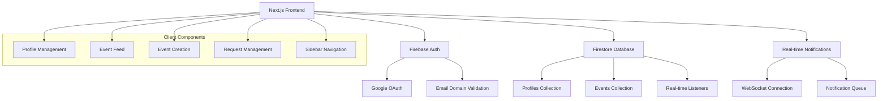

# Design Document

## Overview

The social event planning feature transforms GoOut into a comprehensive platform for University of Michigan students to create profiles, organize events, and connect with peers. The system leverages Firebase Firestore for real-time data synchronization, shadcn/ui for consistent UI components, and WebSocket connections for instant notifications. The architecture emphasizes real-time collaboration, user safety through approval systems, and time-based constraints to encourage spontaneous social activities.

## Architecture

### High-Level Architecture



### Technology Stack

- **Frontend Framework**: Next.js 15.5.3 with App Router
- **UI Components**: shadcn/ui with Tailwind CSS 4
- **Database**: Firebase Firestore for real-time data
- **Authentication**: Firebase Auth with Google OAuth
- **Real-time Communication**: Firestore real-time listeners + WebSocket fallback
- **State Management**: React Context + Custom Hooks
- **Styling**: Tailwind CSS with shadcn/ui components

## Components and Interfaces

### Core Components

#### 1. Profile Management System
- **ProfileForm**: Complete profile creation/editing with image uploads
- **ProfileCard**: Display user profiles in various contexts
- **ProfileGallery**: Grid view of user photos and events attended
- **UsernameValidator**: Real-time username availability checking

#### 2. Event Management System
- **EventCreationForm**: Time-constrained event creation with validation
- **EventCard**: Display events in feed with interaction buttons
- **EventDetailsModal**: Full event information with attendee management
- **TimeValidator**: Enforce 12-hour future limit and 12AM-5AM restrictions

#### 3. Social Interaction System
- **RequestButton**: Join event requests with loading states
- **ApprovalPanel**: Host interface for managing event requests
- **AttendeeList**: Display approved participants
- **NotificationCenter**: Real-time notification display

#### 4. Navigation and Layout
- **Sidebar**: Three-section navigation (Plans, People, Profile)
- **MobileNavigation**: Responsive mobile navigation
- **Layout**: Consistent page structure with authentication guards

### Data Interfaces

#### Profile Schema
```typescript
interface Profile {
  id: string;
  name: string;
  profile_pic_url: string;
  profile_cover_photo: string;
  dept: string;
  username: string;
  email: string;
  you_met: string[];           // Array of user IDs
  events: string[];            // Array of event IDs
  photos: string[];            // Array of photo URLs
  created_at: Timestamp;
  updated_at: Timestamp;
}
```

#### Event Schema
```typescript
interface Event {
  id: string;
  name: string;
  poster_url: string;
  time_created_at: Timestamp;
  time_event_time: Timestamp;
  host: string;                // User ID
  category: string;
  requests: string[];          // Array of user IDs
  approved: string[];          // Array of user IDs
  description?: string;
  location?: string;
  max_attendees?: number;
}
```

#### Notification Schema
```typescript
interface Notification {
  id: string;
  recipient_id: string;
  sender_id: string;
  type: 'event_request' | 'request_approved' | 'request_denied';
  event_id: string;
  message: string;
  read: boolean;
  created_at: Timestamp;
}
```

## Data Models

### Firestore Collections Structure

```
/profiles/{userId}
  - name: string
  - profile_pic_url: string
  - profile_cover_photo: string
  - dept: string
  - username: string (unique)
  - email: string
  - you_met: array of user IDs
  - events: array of event IDs
  - photos: array of URLs
  - created_at: timestamp
  - updated_at: timestamp

/events/{eventId}
  - name: string
  - poster_url: string
  - time_created_at: timestamp
  - time_event_time: timestamp
  - host: string (user ID)
  - category: string
  - requests: array of user IDs
  - approved: array of user IDs
  - description: string (optional)
  - location: string (optional)
  - max_attendees: number (optional)

/notifications/{notificationId}
  - recipient_id: string
  - sender_id: string
  - type: string
  - event_id: string
  - message: string
  - read: boolean
  - created_at: timestamp
```

### Real-time Data Synchronization

#### Firestore Real-time Listeners
```typescript
// Event feed listener
const unsubscribeEvents = onSnapshot(
  query(
    collection(db, 'events'),
    where('time_created_at', '>=', twelveHoursAgo),
    orderBy('time_created_at', 'desc')
  ),
  (snapshot) => {
    const events = snapshot.docs.map(doc => ({
      id: doc.id,
      ...doc.data()
    }));
    setEvents(events);
  }
);

// User notifications listener
const unsubscribeNotifications = onSnapshot(
  query(
    collection(db, 'notifications'),
    where('recipient_id', '==', currentUserId),
    where('read', '==', false),
    orderBy('created_at', 'desc')
  ),
  (snapshot) => {
    const notifications = snapshot.docs.map(doc => ({
      id: doc.id,
      ...doc.data()
    }));
    setNotifications(notifications);
  }
);
```

## Error Handling

### Client-Side Error Handling

#### Authentication Errors
- **Invalid Email Domain**: Redirect to waitlist with clear messaging
- **Network Connectivity**: Offline mode with cached data
- **Session Expiry**: Automatic re-authentication flow

#### Data Validation Errors
- **Profile Validation**: Real-time field validation with user feedback
- **Event Time Constraints**: Prevent invalid time selections with clear messages
- **Username Conflicts**: Immediate feedback during typing

#### Firestore Errors
- **Permission Denied**: Graceful fallback with retry options
- **Network Errors**: Offline indicator with sync status
- **Quota Exceeded**: User notification with guidance

### Error Recovery Strategies

```typescript
// Retry mechanism for failed operations
const retryOperation = async (operation: () => Promise<any>, maxRetries = 3) => {
  for (let i = 0; i < maxRetries; i++) {
    try {
      return await operation();
    } catch (error) {
      if (i === maxRetries - 1) throw error;
      await new Promise(resolve => setTimeout(resolve, 1000 * Math.pow(2, i)));
    }
  }
};

// Offline data management
const useOfflineSupport = () => {
  const [isOnline, setIsOnline] = useState(navigator.onLine);
  
  useEffect(() => {
    const handleOnline = () => setIsOnline(true);
    const handleOffline = () => setIsOnline(false);
    
    window.addEventListener('online', handleOnline);
    window.addEventListener('offline', handleOffline);
    
    return () => {
      window.removeEventListener('online', handleOnline);
      window.removeEventListener('offline', handleOffline);
    };
  }, []);
  
  return isOnline;
};
```

## Testing Strategy

### Unit Testing
- **Component Testing**: React Testing Library for UI components
- **Hook Testing**: Custom hooks with mock Firestore data
- **Utility Functions**: Time validation, data transformation functions
- **Authentication Logic**: Mock Firebase Auth responses

### Integration Testing
- **Firestore Integration**: Test real-time listeners and data synchronization
- **Authentication Flow**: End-to-end user login and profile creation
- **Event Lifecycle**: Create, request, approve, attend event flow
- **Notification System**: Real-time notification delivery and display

### End-to-End Testing
- **User Journeys**: Complete user flows from login to event participation
- **Cross-browser Testing**: Ensure compatibility across modern browsers
- **Mobile Responsiveness**: Test on various device sizes
- **Performance Testing**: Load testing with multiple concurrent users

### Testing Tools and Setup
```typescript
// Jest configuration for Firebase testing
import { initializeTestEnvironment } from '@firebase/rules-unit-testing';

const testEnv = await initializeTestEnvironment({
  projectId: 'test-project',
  firestore: {
    rules: fs.readFileSync('firestore.rules', 'utf8'),
  },
});

// Mock Firestore for component testing
jest.mock('firebase/firestore', () => ({
  collection: jest.fn(),
  doc: jest.fn(),
  onSnapshot: jest.fn(),
  addDoc: jest.fn(),
  updateDoc: jest.fn(),
}));
```

### Performance Considerations

#### Firestore Optimization
- **Composite Indexes**: Optimize queries for event feed and user searches
- **Data Pagination**: Implement cursor-based pagination for large datasets
- **Offline Persistence**: Enable Firestore offline support for better UX
- **Query Optimization**: Minimize real-time listeners and use efficient queries

#### Image Handling
- **Image Compression**: Client-side compression before upload
- **CDN Integration**: Use Firebase Storage with CDN for fast image delivery
- **Lazy Loading**: Implement intersection observer for image loading
- **Progressive Enhancement**: Show placeholders while images load

#### Real-time Performance
- **Connection Management**: Efficiently manage WebSocket connections
- **Debounced Updates**: Prevent excessive re-renders from rapid data changes
- **Memory Management**: Properly cleanup listeners to prevent memory leaks
- **Batch Operations**: Group related Firestore operations for efficiency